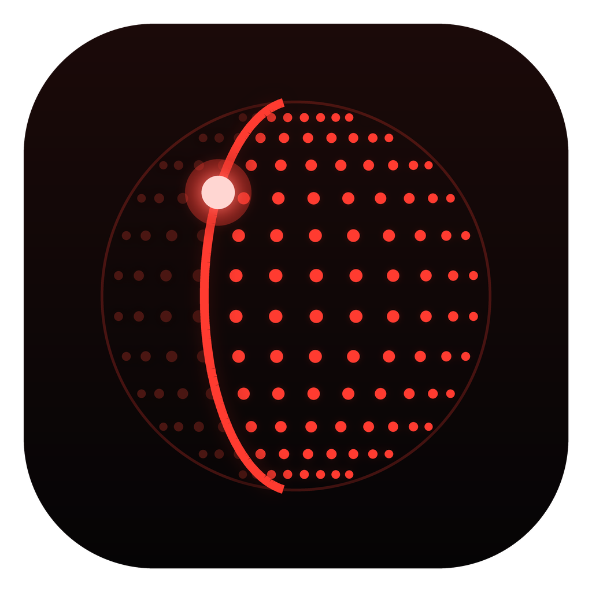
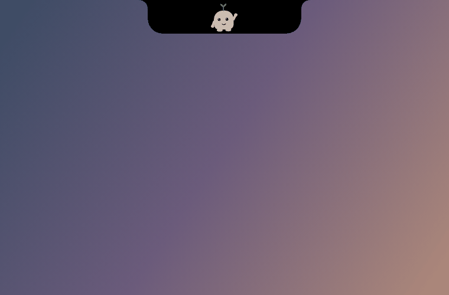
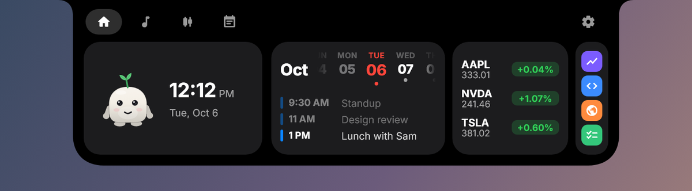
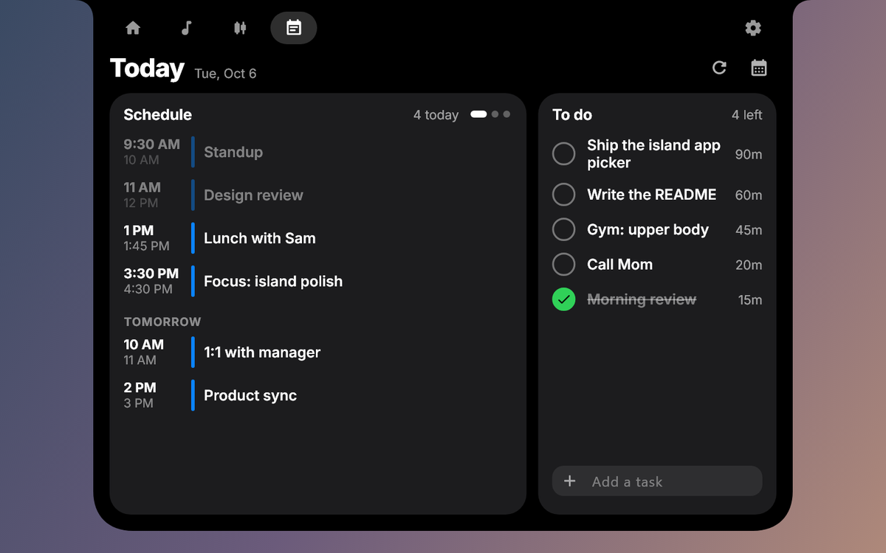
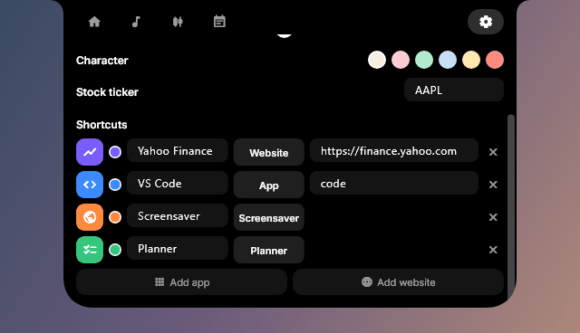
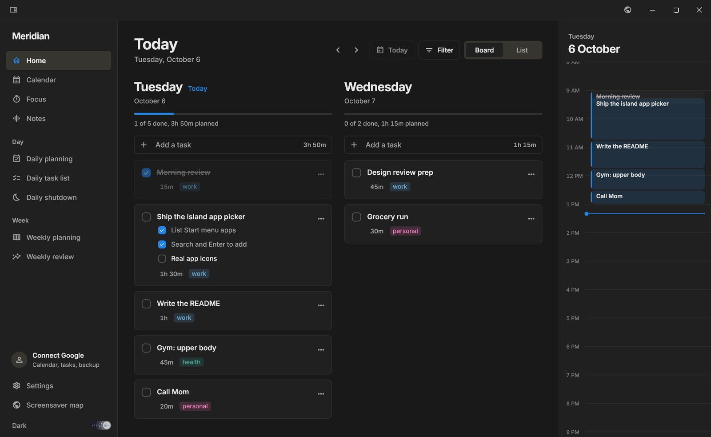
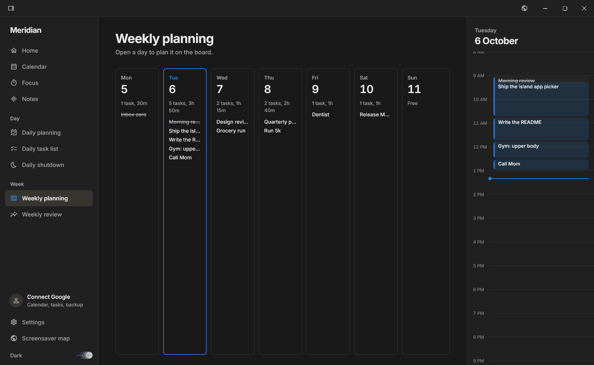
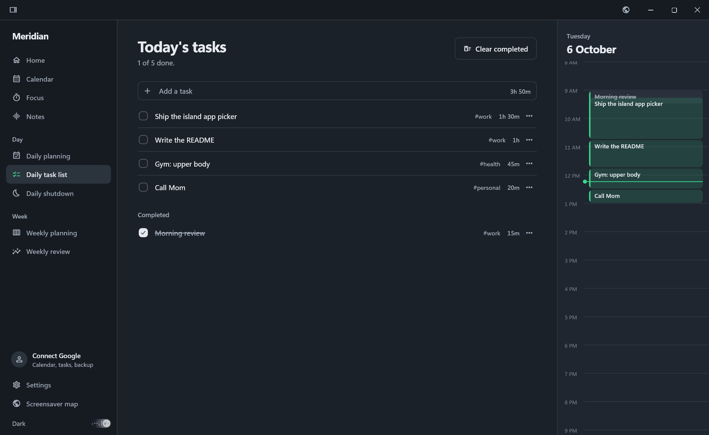
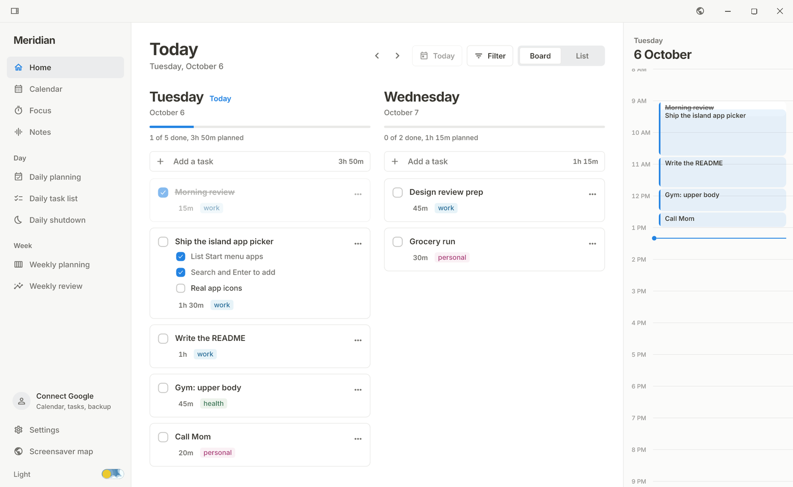
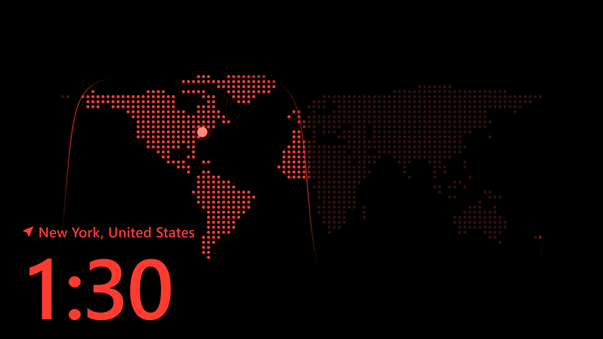

<div align="center">



# Meridian

**A dynamic island, a day planner and a living world map for Windows.**

A small pill hangs from the top of your screen and opens into your music,
your day, your stocks and your shortcuts. Behind it sits a planner for the
day and the week, and a screensaver that shows where the sun is right now.



</div>

---

## Contents

- [The dynamic island](#the-dynamic-island)
- [App shortcuts](#app-shortcuts)
- [The planner](#the-planner)
- [The world map](#the-world-map)
- [Meeting notes](#meeting-notes)
- [Draw on your screen](#draw-on-your-screen)
- [Install](#install)
- [Build from source](#build-from-source)
- [How it works](#how-it-works)
- [Your data](#your-data)

## The dynamic island

The island is always on top and works over any app. It rests as a small pill
at the top of your screen. Click it (or hover, if you prefer) and it opens.

| Home | Today |
| :---: | :---: |
|  |  |
| The time, this week at a glance, your watchlist and your shortcuts, with Pip keeping you company. | Today's schedule from your calendars beside the planner's to-do list. Tick tasks off right here. |

- **Home:** the clock, a swipeable week strip with dots on days that have
  events, live prices for your watchlist, and your quick-launch shortcuts.
- **Music:** whatever is playing in any app (Spotify, a browser, anything
  Windows media keys control), with progress, controls and a visualizer
  that moves with your speakers.
- **Stocks:** your watchlist with day sparklines. Tap one for a candle or
  bar chart, an RSI and MACD read, and the latest news.
- **Today:** your schedule from Google Calendar or any iCal link, and the
  planner's tasks for today.
- **Pip:** a little companion who flies between his spots as the island
  opens and closes, and lands with a squish.

<div align="center">

</div>

When music starts, the pill pops up with the song for a moment. It stays
quiet when Chrome is in front, so it never covers a tab strip.
It follows Windows' **Animation effects** setting too: with it off, the
island and Pip move without the bounce.

### Quick capture

Press **Ctrl+Shift+Alt** together and let go, from any app, and the island
opens a box to type a task into. Write `call mum 15m tomorrow` and it lands
on tomorrow as a 15 minute task. Enter adds it and hands the keyboard back
to whatever you were doing. **Ctrl+Alt+N** does the same.

### Reminders

Five minutes before a timed event or a planner task with a set time, the
pill counts down to it. Calls get a **Join** button for Zoom, Meet or
Teams; tasks get **Focus**, which starts a focus session on them. Choose
calls only, or turn reminders off, in the island's settings.

### The Hello screen

Step away for a few minutes and Meridian's world map comes up full screen.
When you come back, touch a key or the mouse: Windows Hello checks it's you
while the island turns into a square and scans, with a face that looks
around for Face ID or a fingerprint waiting for your touch. Once Windows
Hello agrees, the scan turns into a check and the map steps aside. Choose
your PIN instead and the island shows a padlock springing open.

The same animation plays when you sign back in after locking Windows. The
Hello screen is a welcome, not a lock: Windows' own lock is what keeps the
PC safe. Set the delay, or turn it off, in the island's settings.

<div align="center">

</div>

## App shortcuts

Click **Add app** in the island's settings, type a few letters and press
Enter. Meridian lists everything in your Start menu, Microsoft Store apps
included, and each shortcut wears the app's own icon. Websites work too.

<div align="center">

</div>

## The planner

A calm place to plan the day and the week. Give each task a time estimate,
see it land on the schedule beside the board, and close the day with a
shutdown.



| Weekly planning | Daily task list |
| :---: | :---: |
|  |  |

- **Home:** today and tomorrow as columns, subtasks, time estimates, tags,
  and a progress bar for the day.
- **Daily planning, task list and shutdown:** a ritual for starting and
  ending each day.
- **Weekly planning and review:** see the whole week, then look back on it:
  what got done, what is still open, and how your estimates compared with
  the time focus sessions actually took.
- **Repeating tasks:** every day, every weekday, weekly or monthly. Tick
  one off and the next appears; a missed one stays on its day.
- **Focus:** a timer for the task you are on.
- **Calendar:** day, week and month views; drag events and tasks to reschedule them.
- **Google:** sign in once and your Calendar, Tasks and birthdays appear,
  and the planner backs up to your own Drive.
- **Yours to style:** light or dark, and a choice of fonts.

<details>
<summary>Light mode</summary>



</details>

## The world map

Meridian's screensaver is a dot map of the world, lit where the sun is up
right now, with your location and a big clock. Move the mouse and the dots
drift out of its way.

<div align="center">

</div>



## Meeting notes

When a Zoom, Google Meet or Teams call starts, the island offers to take
notes. Meridian records the meeting app's own audio and transcribes it **on
your computer** with [whisper.cpp](https://github.com/ggml-org/whisper.cpp);
nothing is uploaded.

To set it up once, put `whisper-cli.exe` and the `ggml-base.en.bin` model in
`%APPDATA%\AodWorldMap\whisper`. The Notes page has a button that opens the
folder.

## Draw on your screen

Press **Ctrl+Shift+A** to draw over anything on screen: pens, a highlighter,
lines, arrows, boxes, stamps and text, with undo. The vanishing pen fades a
moment after each stroke, which is handy for pointing things out on a call.
Press it again to hide.

Press **Ctrl+Shift+Space** to ask Claude about what is on screen. It answers
by drawing on the screen. This needs an [Anthropic API
key](https://console.anthropic.com/): set `ANTHROPIC_API_KEY`, or paste the
key into the panel, which saves it to `%APPDATA%\AodWorldMap\anthropic.key`.

## Install

Meridian runs on Windows 10 and 11 (64-bit).

Build the installer (see below) and run `Meridian-Setup-<version>.exe`. It
installs for your user only, with no admin prompt. It offers a desktop
shortcut and to start the island when you sign in, and Uninstall leaves
your data in place.

The installer is not code-signed yet, so Windows SmartScreen will warn
about an unknown publisher the first time.

## Build from source

You need [Flutter](https://docs.flutter.dev/get-started/install/windows/desktop)
and Visual Studio with the **Desktop development with C++** workload.

```bash
git clone https://github.com/BrinHan/Productivity-App.git
cd Productivity-App/aod_world_map
flutter run -d windows
```

**Google sign-in** needs an OAuth client. Copy `google_client.example.json` to
`google_client.json`, fill in your client ID and secret, and run with:

```bash
flutter run -d windows --dart-define-from-file=google_client.json
```

**The installer** needs [Inno Setup 6](https://jrsoftware.org/isinfo.php)
(`winget install JRSoftware.InnoSetup`). This builds the release app and
packages it into `build\installer\`, using `google_client.json` when present:

```bash
powershell -ExecutionPolicy Bypass -File build_installer.ps1
```

If a build fails with `No target "aod_world_map"` after pulling, run
`flutter clean` once. The exe was renamed to `meridian.exe`.

## How it works

One exe runs as up to three processes, so each stays small:

| Process | Started by | Does |
| --- | --- | --- |
| `meridian.exe --island` | the app, or sign-in | The always-on-top island. Owns music, meeting detection and recording. Keeps running when the app window closes. |
| `meridian.exe` | you | The app window: the planner (`--home`) or the world map. |
| `meridian.exe --overlay` | the island | The drawing layer, kept warm so it opens instantly. |

They talk over local sockets and share the files in `%APPDATA%\AodWorldMap`.
A few Windows features (the media session, speaker levels, Start menu icons
and meeting audio) come from small C# helpers, built on first use with the
.NET compiler that ships with Windows.

```
aod_world_map/
  lib/aod/              world map: dot grid, sun math, the face
  lib/desktop/          island, planner, notes, stocks, shortcuts
  lib/desktop/annotate/ the drawing overlay and the AI agent
  windows/runner/       native window setup
  windows/installer/    Inno Setup script
  tool/                 icon and README media generators
```

## Your data

Everything lives on your computer, in `%APPDATA%\AodWorldMap`: the planner,
island settings, meeting notes and app icons. Nothing is sent anywhere
unless you turn it on:

- **Google:** only after you sign in, straight between you and Google.
- **Stocks:** prices and news come from Yahoo Finance.
- **Location:** the map asks Windows for a rough location, or falls back to
  your IP address.
- **Ask Claude:** sends a screenshot to Anthropic only when you ask.
- **Updates:** once a day Meridian asks GitHub whether a newer version is
  out. Nothing about you is sent.

Saves can't be left half written, and each file keeps an hourly `.bak`
copy. **Settings > Your data** saves everything (tasks, settings and
meeting notes, but not sign-ins) to one backup file and restores from one.
If something goes wrong, **Settings > About > Copy diagnostics** copies the
error log from `%APPDATA%\AodWorldMap\logs` for a bug report.

---

<sub>Screenshots and GIFs use demo data and are rendered with
<code>tool/readme/capture_test.dart</code>; see
<code>tool/readme/make_media.py</code> to regenerate them.</sub>
